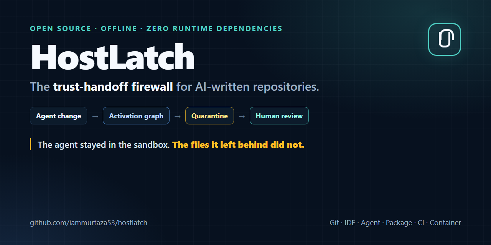

# HostLatch

[](https://github.com/iammurtaza53/hostlatch/actions/workflows/ci.yml)
[](LICENSE)
[](package.json)

**The trust-handoff firewall for AI-written repositories.**

> The agent stayed inside its sandbox. The files it left behind did not.

HostLatch is an offline CLI that finds repository changes which a trusted tool may execute later: agent hooks, MCP commands, IDE tasks, package lifecycle scripts, CI privileges, Git drivers, development-container bootstrap commands, and escaping symlinks.

It is built for developers and teams using Claude Code, Codex, Cursor, GitHub Copilot, Gemini CLI, and other AI coding agents.



## The problem

Coding-agent sandboxes constrain what an agent can execute during a run. They do not automatically make every file written by that agent safe for the host to trust afterward.

```text
agent writes .vscode/tasks.json
          ↓
developer opens the trusted workspace
          ↓
VS Code runs a command outside the agent sandbox
```

The [Cloud Security Alliance documented this trust-handoff class](https://labs.cloudsecurityalliance.org/research/csa-research-note-ai-coding-agent-sandbox-escapes-20260722-c/) across major coding agents. HostLatch turns that boundary into an explicit review gate.

## What makes HostLatch different

HostLatch does not try to replace an agent sandbox, malware scanner, or general SAST product. Its narrow job is to answer:

> Which changes from this agent task can acquire more authority when Git, an IDE, a package manager, CI, a container tool, or another agent consumes them later?

Three mechanisms support that decision:

1. **Git-delta analysis** compares the task with a chosen base, so pre-existing configuration is not misreported as newly introduced authority.
2. **Activation graphs** explain each path as artifact → trusted consumer → future trigger → host effect.
3. **Quarantine-first promotion** splits ordinary changes from activation-bearing changes into an inert, hash-bound bundle.

Several projects scan AI configuration or sandbox live agents. HostLatch complements them by focusing on the post-agent handoff and promotion workflow. See the [research comparison](docs/RESEARCH.md).

## Try it in 60 seconds

Requires Node.js 22.13 or newer and Git.

```bash
git clone https://github.com/iammurtaza53/hostlatch.git
cd hostlatch
npm ci
npm link

# Run a self-contained, harmless trust-handoff demonstration
npm run demo

hostlatch scan /path/to/repository --base main
```

Example result:

```text
HostLatch BLOCK  risk=40/100  manifest=hl_7fa1c3...
Changed files: 8  findings: 1

[HIGH] HL-IDE-201  .vscode/tasks.json
VS Code task execution was introduced or changed
  path: VS Code task runner -> task activation -> host command execution
```

Nothing from the scanned repository is imported, installed, built, or executed.

See the [reproducible demo](docs/DEMO.md) for the fixture and expected result.

## Quarantine a change set

```bash
hostlatch bundle /path/to/repository \
  --base main \
  --output /tmp/hostlatch-review \
  --fail-on never
```

The output is deliberately inert:

```text
hostlatch-review/
├── data-plane/       # changed files with no HostLatch activation finding
├── quarantine/       # control-plane or boundary-crossing changes
├── inventory.json    # status, mode, zone, and content hash
├── manifest.json     # findings plus activation graph
└── README.md         # reviewer instructions
```

“Data plane” does not mean safe or correct; it means no known HostLatch activation surface was detected. Quarantined files must be reviewed before promotion.

## Commands

| Command | Purpose |
| --- | --- |
| `hostlatch scan [path]` | Scan committed, staged, unstaged, and untracked changes |
| `hostlatch bundle [path] --output <dir>` | Split a change set into data-plane and quarantined artifacts |
| `hostlatch explain <manifest.json>` | Explain a stored decision without rescanning |
| `hostlatch --version` | Print the installed version |

Important options:

```text
--base <ref>           Git commit or ref to compare
--json                 Emit structured JSON
--output <path>        Manifest file or new bundle directory
--fail-on <level>      block (default), review, or never
--max-file-bytes <n>   Per-file inspection limit
```

Exit codes are `0` for allowed/below threshold, `2` for review, `3` for blocked, and `1` for scanner or usage errors.

## Detection coverage

- AI-agent hooks, MCP server commands, permission bypasses, and disabled sandboxes
- VS Code tasks, automatic tasks, interpreters, and executable-path settings
- npm-compatible install, prepare, pack, and publish lifecycle scripts
- Git attributes, external drivers, filters, and submodule changes
- privileged CI triggers, write tokens, identity tokens, inherited secrets, and self-hosted runners
- development-container commands, host mounts, host networking, and privileged modes
- shell environment and task-runner control files
- symlinks that escape the repository boundary
- newly executable files and control files that exceed the inspection limit
- nested package and tool configurations in monorepos

Rules are delta-aware: HostLatch reports newly introduced or changed behavior rather than presenting every existing setting as a new threat.

## CI usage

```yaml
- name: Scan trust-handoff changes
  run: node ./bin/hostlatch.js scan . --base origin/main --fail-on review
```

Use `--json --output hostlatch-manifest.json` to retain an audit artifact. A reusable GitHub Action and SARIF output are planned after the CLI policy stabilizes.

## Security model and limitations

HostLatch is a defense-in-depth control, not proof that a repository is safe. It does not detect every malicious application-code path, replace isolation, scan secrets, or verify dependency integrity. Rule coverage is explicit and incomplete by design.

Read the full [threat model](docs/THREAT_MODEL.md). Please report vulnerabilities through [GitHub private vulnerability reporting](SECURITY.md), not a public issue.

## Project status

HostLatch is an **experimental v0.1 release**. The scanner, activation manifest, and quarantine bundle are functional and covered by cross-platform tests. The [roadmap](docs/ROADMAP.md) defines the release bar for signed approvals, clean-worktree promotion, enforcement adapters, and reproducible benchmarks.

Do not describe HostLatch as “state of the art” until those benchmarks exist.

## Contributing

New activation paths and bypass fixtures are especially valuable. See [CONTRIBUTING.md](CONTRIBUTING.md) before opening a pull request.

## License

[MIT](LICENSE)
